Squeaknode is a peer-to-peer social media app that lets you make posts and view posts from other people, incentivized with lightning payments.

This guide will go over some of the things you can do with the app

## Set up a signing profile
The first thing you might want to do is create a signing profile. This profile allows you to create squeaks, and it will be your identity that other users will see attached to your squeaks. You can create as many signing profiles as you want.

- Go to the profiles page
- Click the "Create Signing Profile" button
- Enter any name that you want for your profile and submit

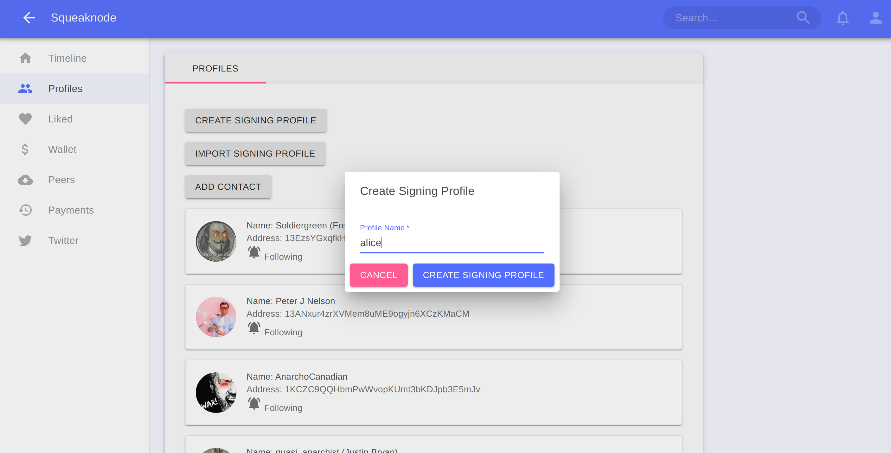

## Make a squeak
After you have a signing profile, you can now make a squeak.

- Go to the timeline page
- Click on the button in the bottom right corner to open the "Make Squeak" dialog
- Select the signing profile from the form selection
- Enter any text (and emojis) that you want, up to 280 characters and submit

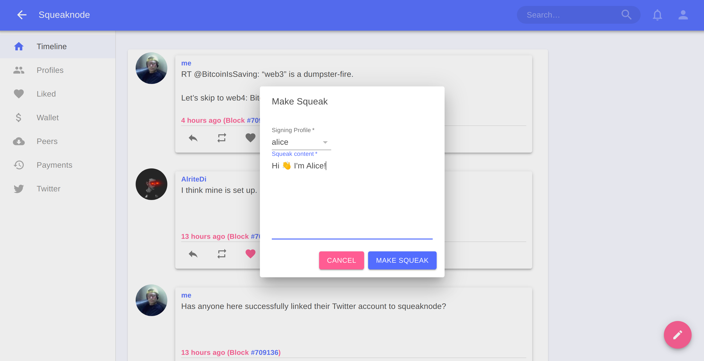

## Connect to other nodes
After you have created some squeaks, you may be wondering if anyone else can read them. Other users will only be able to download your squeaks if their node is connected to your node (or if they connect to another node that already has copies of your squeaks).

You can establish connections to other nodes in two ways:
1) open a connection to another node using its external address
2) share your node's external address and let other nodes connect to you

Once a connection is established, it doesn't matter which node started the connection, inbound and outbound connections are treated the same.

#### Make an outbound connection
If you know the external address of another squeaknode, you can connect to it directly:

- Go to the "Peers" page
- Click on the "Connect Peer" button
- Enter the external address host in the input form
- Enter the external address port in the input form, if it is anything other than the default (8555)
- Check the "Use Tor" toggle if the address is an onion address
- Submit the dialog form

After a few seconds, if the connection is successful, you should see the newly connected peer in the list of connected peers.

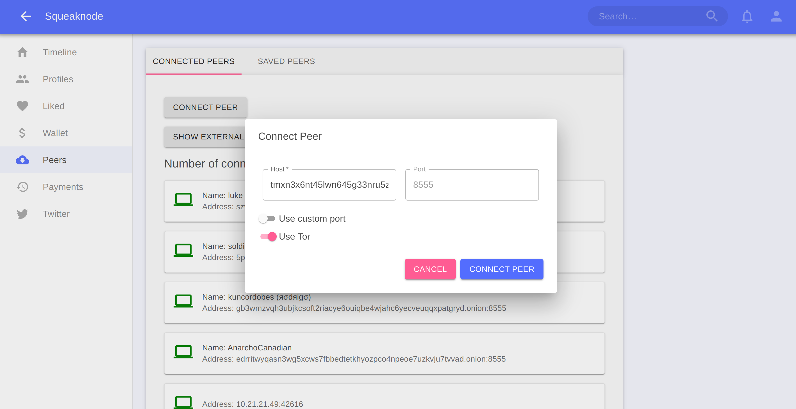

#### Accept inbound connections
You can also share your external address, and allow other nodes to make connections to you.

- Go to the "Peers" page
- Click on the "Show External Address" button
- Copy the content of the displayed address and share it wherever you want

Now anyone who knows this external address can use it to make a connection from their squeaknode to yours.

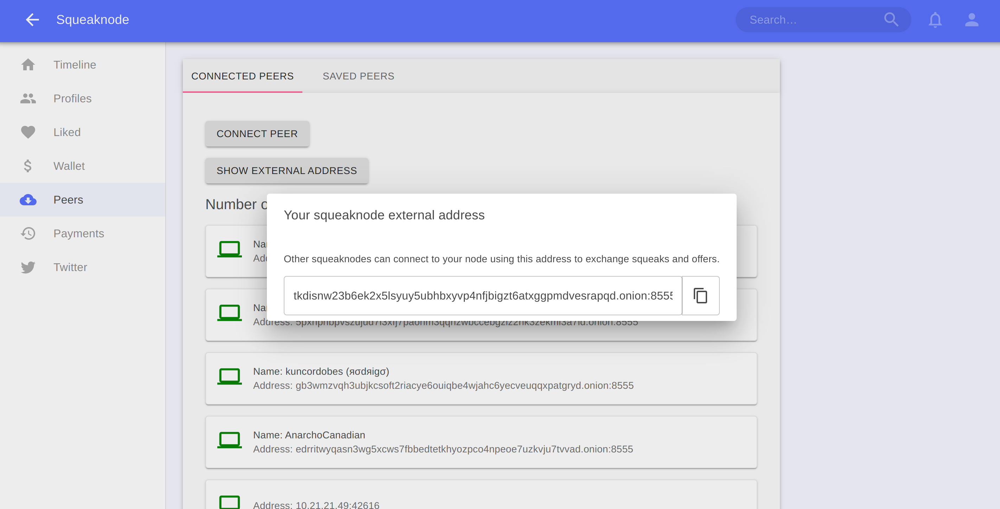

## Download Squeaks from other users
Now that you have some peer connections open, you can begin to download squeaks from other users onto your timeline.

The squeaknode timeline only shows squeaks from profiles that you are following. You can begin to follow profiles by adding contacts.

- Ask a friend (who is running squeaknode) to share with you the address of their signing profile
- Go to the "Profiles" page
- Click on the "Add Contact" button
- Enter the name of the person
- Enter the address that was provided
- Submit the form to create the new contact profile

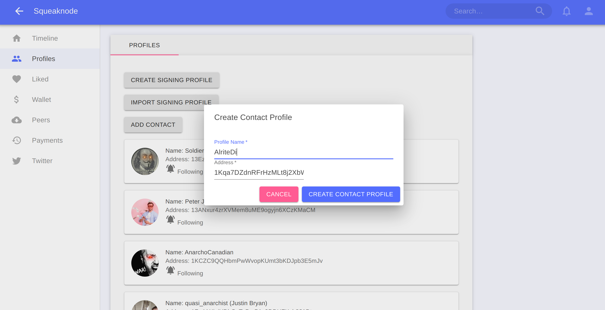

After the contact profile is created, your squeaknode will begin to download squeaks from all of your connected peers that match were authored by that profile. If you go to the "Timeline" page, you should see the squeaks in the timeline, if any were downloaded.

## Buying squeaks
Now you have some squeaks from other users visible in your timeline, but they are locked, so you can't read them.

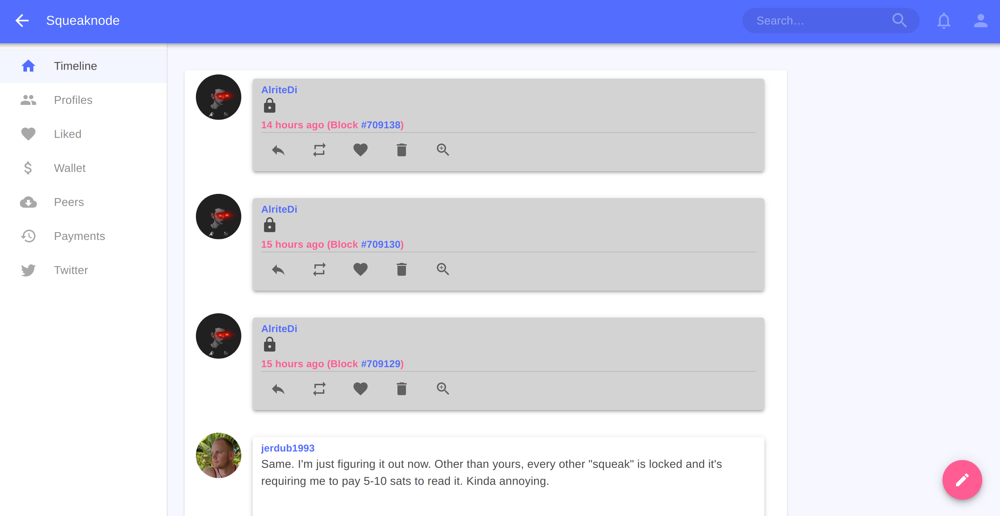

You unlock squeaks by making Lightning payments to the peers that are selling them.

- Click on the squeak that you want to unlock
- Click on the "Buy To Unlock" button in the middle of the squeak
- When the dialog opens, select one of the offers from the selection
- Check the price of the squeak, and if you agree to pay that amount, click the "Buy Squeak" button
- Wait a few seconds for the Lightning payment to complete, and then the squeak should unlock

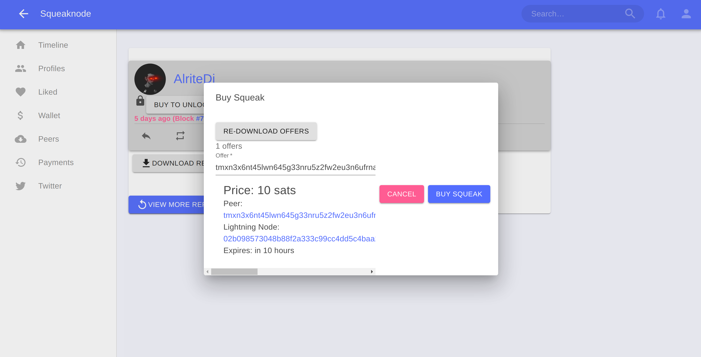

Now you should see the unlocked content of the squeak

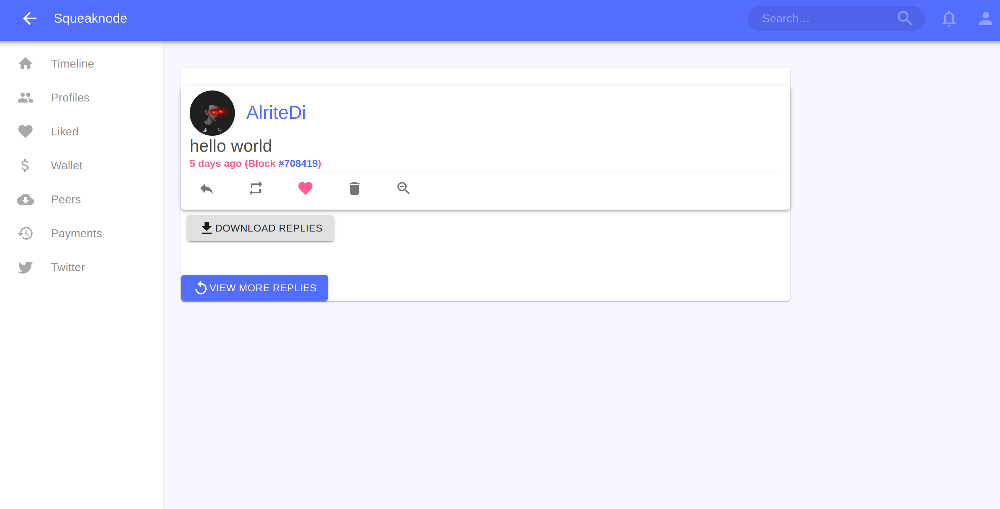

#### Opening a Lightning channel directly to a seller
Sometimes the lightning payment will fail. This usually happens because:
- You do not have a route to the payee
- You do not have enough liquidity in your route

If you want to open a Lightning channel directly to the seller node, you can do that.

- Click on the "Buy To Unlock" button in the middle of the squeak
- When the dialog opens, select one of the offers from the selection
- Click on the link on the "Lightning Node" section of the offer display to go to the "Lightning Node" page
- Click on the "Connect Peer" button to ensure that your Lightning node is connected to the seller Lightning node.
- Click on the "Open Channel" button to open the "Open Channel" dialog
- Enter whatever amount you want to fund the channel and for the transaction fee and submit.
- Now wait for the Bitcoin transactions to complete for the channel to finish opening.

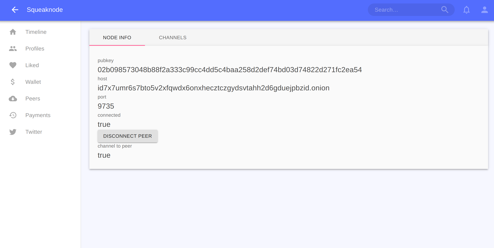

After the channel finishes opening, you should be able to complete the payment without any problems.

## Connect your Twitter account
If you are a Twitter user, you can mirror your tweets automatically to your squeaknode profile.

- Obtain a "bearer token" from Twitter (you have to create a Twitter developer account: https://developer.twitter.com/en/apply-for-access)
- Go to the "Twitter" page in the squeaknode app
- Click the "Set Bearer Token" button and copy the bearer token from your Twitter Developer account
- Click the "Add Twitter Account" button and enter your Twitter handle, and select the signing profile where you want it to be mirrored

After you set your bearer token and add your Twitter handle, your squeaknode will be configured to automatically make new squeaks for any new tweets that are created.

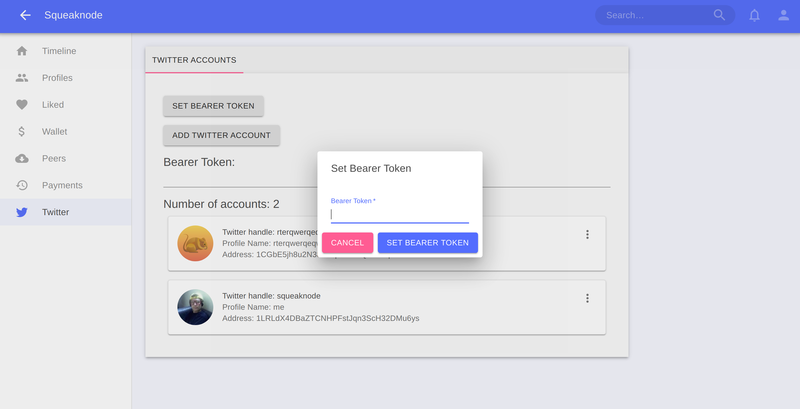
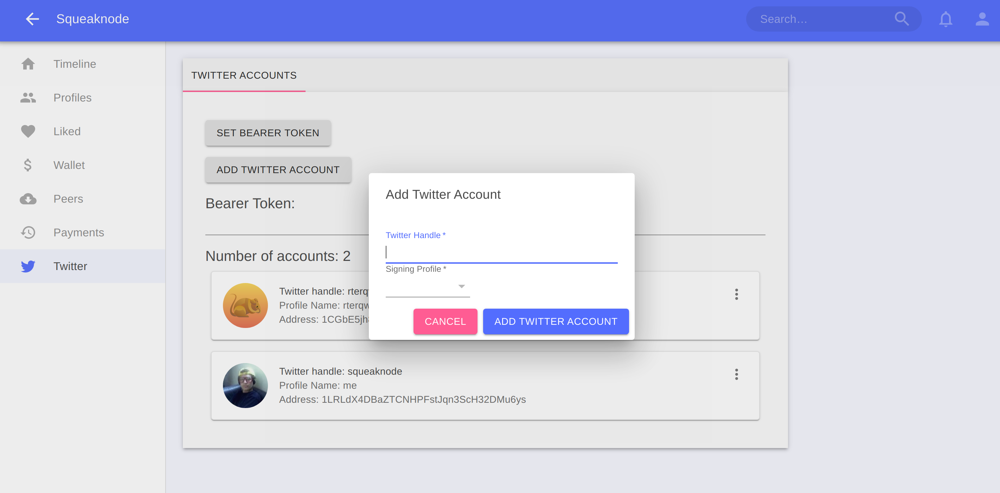
